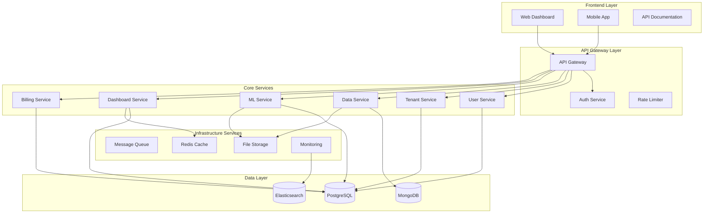

# Design Document

## Overview

This design transforms AstralytiQ from a monolithic Streamlit application into a modular, enterprise-grade SaaS analytics platform. The architecture follows microservices patterns, implements industry-standard security practices, and provides scalable infrastructure suitable for production deployment.

The platform will demonstrate advanced software engineering concepts including clean architecture, domain-driven design, event-driven architecture, and modern DevOps practices - all essential skills for SDE roles.

## Architecture

### High-Level Architecture



### Microservices Architecture

The platform consists of the following microservices:

1. **API Gateway Service**: Request routing, authentication, rate limiting
2. **User Management Service**: Authentication, authorization, user profiles
3. **Tenant Management Service**: Multi-tenancy, organization management
4. **Data Processing Service**: ETL pipelines, data validation, transformation
5. **ML/Analytics Service**: Model training, prediction, forecasting
6. **Dashboard Service**: Visualization, reporting, dashboard management
7. **Billing Service**: Subscription management, usage tracking, payments
8. **Notification Service**: Email, SMS, in-app notifications
9. **Audit Service**: Logging, compliance, security monitoring

## Components and Interfaces

### Core Domain Models

```python
# User Management Domain
class User:
    id: UUID
    email: str
    password_hash: str
    role: UserRole
    tenant_id: UUID
    profile: UserProfile
    created_at: datetime
    last_login: datetime

class Tenant:
    id: UUID
    name: str
    domain: str
    subscription_plan: SubscriptionPlan
    settings: TenantSettings
    created_at: datetime
    is_active: bool

# Data Processing Domain
class Dataset:
    id: UUID
    name: str
    tenant_id: UUID
    schema: DataSchema
    source_type: DataSourceType
    file_path: str
    metadata: dict
    created_at: datetime

class DataPipeline:
    id: UUID
    name: str
    tenant_id: UUID
    source_config: dict
    transformations: List[Transformation]
    schedule: CronSchedule
    status: PipelineStatus

# ML/Analytics Domain
class MLModel:
    id: UUID
    name: str
    tenant_id: UUID
    model_type: ModelType
    version: str
    parameters: dict
    metrics: ModelMetrics
    artifact_path: str
    status: ModelStatus

class Prediction:
    id: UUID
    model_id: UUID
    input_data: dict
    output_data: dict
    confidence: float
    created_at: datetime
```

### Service Interfaces

```python
# User Service Interface
class IUserService:
    async def create_user(self, user_data: CreateUserRequest) -> User
    async def authenticate_user(self, email: str, password: str) -> AuthToken
    async def get_user_by_id(self, user_id: UUID) -> User
    async def update_user_profile(self, user_id: UUID, profile: UserProfile) -> User
    async def deactivate_user(self, user_id: UUID) -> bool

# Data Service Interface
class IDataService:
    async def upload_dataset(self, tenant_id: UUID, file: UploadFile) -> Dataset
    async def validate_dataset(self, dataset_id: UUID) -> ValidationResult
    async def transform_dataset(self, dataset_id: UUID, transformations: List[Transformation]) -> Dataset
    async def get_dataset_preview(self, dataset_id: UUID, limit: int = 100) -> DataPreview
    async def delete_dataset(self, dataset_id: UUID) -> bool

# ML Service Interface
class IMLService:
    async def train_model(self, training_request: TrainingRequest) -> MLModel
    async def predict(self, model_id: UUID, input_data: dict) -> Prediction
    async def get_model_metrics(self, model_id: UUID) -> ModelMetrics
    async def deploy_model(self, model_id: UUID, deployment_config: DeploymentConfig) -> Deployment
    async def get_model_versions(self, model_name: str, tenant_id: UUID) -> List[MLModel]
```

### API Layer Design

```python
# FastAPI Router Structure
from fastapi import APIRouter, Depends, HTTPException
from fastapi.security import HTTPBearer

# Authentication dependency
async def get_current_user(token: str = Depends(HTTPBearer())) -> User:
    # JWT token validation logic
    pass

# Tenant context dependency
async def get_tenant_context(user: User = Depends(get_current_user)) -> TenantContext:
    # Extract tenant information from user
    pass

# User Management Endpoints
user_router = APIRouter(prefix="/api/v1/users", tags=["users"])

@user_router.post("/register", response_model=UserResponse)
async def register_user(user_data: CreateUserRequest):
    pass

@user_router.post("/login", response_model=AuthResponse)
async def login_user(credentials: LoginRequest):
    pass

@user_router.get("/profile", response_model=UserProfile)
async def get_user_profile(user: User = Depends(get_current_user)):
    pass

# Data Management Endpoints
data_router = APIRouter(prefix="/api/v1/data", tags=["data"])

@data_router.post("/datasets", response_model=DatasetResponse)
async def upload_dataset(
    file: UploadFile,
    tenant: TenantContext = Depends(get_tenant_context)
):
    pass

@data_router.get("/datasets/{dataset_id}", response_model=DatasetResponse)
async def get_dataset(
    dataset_id: UUID,
    tenant: TenantContext = Depends(get_tenant_context)
):
    pass

# ML/Analytics Endpoints
ml_router = APIRouter(prefix="/api/v1/ml", tags=["machine-learning"])

@ml_router.post("/models/train", response_model=TrainingResponse)
async def train_model(
    training_request: TrainingRequest,
    tenant: TenantContext = Depends(get_tenant_context)
):
    pass

@ml_router.post("/models/{model_id}/predict", response_model=PredictionResponse)
async def make_prediction(
    model_id: UUID,
    prediction_request: PredictionRequest,
    tenant: TenantContext = Depends(get_tenant_context)
):
    pass
```

## Data Models

### Database Schema Design

```sql
-- Users and Authentication
CREATE TABLE users (
    id UUID PRIMARY KEY DEFAULT gen_random_uuid(),
    email VARCHAR(255) UNIQUE NOT NULL,
    password_hash VARCHAR(255) NOT NULL,
    role VARCHAR(50) NOT NULL,
    tenant_id UUID NOT NULL,
    profile JSONB,
    created_at TIMESTAMP DEFAULT NOW(),
    updated_at TIMESTAMP DEFAULT NOW(),
    last_login TIMESTAMP,
    is_active BOOLEAN DEFAULT TRUE
);

-- Multi-tenancy
CREATE TABLE tenants (
    id UUID PRIMARY KEY DEFAULT gen_random_uuid(),
    name VARCHAR(255) NOT NULL,
    domain VARCHAR(255) UNIQUE,
    subscription_plan VARCHAR(50) NOT NULL,
    settings JSONB,
    created_at TIMESTAMP DEFAULT NOW(),
    updated_at TIMESTAMP DEFAULT NOW(),
    is_active BOOLEAN DEFAULT TRUE
);

-- Data Management
CREATE TABLE datasets (
    id UUID PRIMARY KEY DEFAULT gen_random_uuid(),
    name VARCHAR(255) NOT NULL,
    tenant_id UUID NOT NULL REFERENCES tenants(id),
    schema_definition JSONB,
    source_type VARCHAR(50) NOT NULL,
    file_path VARCHAR(500),
    metadata JSONB,
    row_count INTEGER,
    size_bytes BIGINT,
    created_at TIMESTAMP DEFAULT NOW(),
    updated_at TIMESTAMP DEFAULT NOW(),
    is_active BOOLEAN DEFAULT TRUE
);

-- ML Models
CREATE TABLE ml_models (
    id UUID PRIMARY KEY DEFAULT gen_random_uuid(),
    name VARCHAR(255) NOT NULL,
    tenant_id UUID NOT NULL REFERENCES tenants(id),
    model_type VARCHAR(50) NOT NULL,
    version VARCHAR(50) NOT NULL,
    parameters JSONB,
    metrics JSONB,
    artifact_path VARCHAR(500),
    status VARCHAR(50) NOT NULL,
    created_at TIMESTAMP DEFAULT NOW(),
    updated_at TIMESTAMP DEFAULT NOW(),
    UNIQUE(name, tenant_id, version)
);

-- Predictions
CREATE TABLE predictions (
    id UUID PRIMARY KEY DEFAULT gen_random_uuid(),
    model_id UUID NOT NULL REFERENCES ml_models(id),
    input_data JSONB NOT NULL,
    output_data JSONB NOT NULL,
    confidence FLOAT,
    execution_time_ms INTEGER,
    created_at TIMESTAMP DEFAULT NOW()
);

-- Billing and Usage
CREATE TABLE usage_metrics (
    id UUID PRIMARY KEY DEFAULT gen_random_uuid(),
    tenant_id UUID NOT NULL REFERENCES tenants(id),
    metric_type VARCHAR(50) NOT NULL,
    metric_value BIGINT NOT NULL,
    recorded_at TIMESTAMP DEFAULT NOW(),
    metadata JSONB
);

-- Audit Logs
CREATE TABLE audit_logs (
    id UUID PRIMARY KEY DEFAULT gen_random_uuid(),
    tenant_id UUID REFERENCES tenants(id),
    user_id UUID REFERENCES users(id),
    action VARCHAR(100) NOT NULL,
    resource_type VARCHAR(50),
    resource_id UUID,
    details JSONB,
    ip_address INET,
    user_agent TEXT,
    created_at TIMESTAMP DEFAULT NOW()
);
```

### NoSQL Data Models (MongoDB)

```javascript
// Raw dataset storage
{
  _id: ObjectId,
  dataset_id: UUID,
  tenant_id: UUID,
  data: [
    {
      // Dynamic schema based on dataset
    }
  ],
  created_at: ISODate,
  updated_at: ISODate
}

// Time-series data for analytics
{
  _id: ObjectId,
  tenant_id: UUID,
  metric_name: String,
  timestamp: ISODate,
  value: Number,
  dimensions: {
    // Key-value pairs for filtering
  }
}

// Dashboard configurations
{
  _id: ObjectId,
  dashboard_id: UUID,
  tenant_id: UUID,
  user_id: UUID,
  name: String,
  layout: {
    // Dashboard layout configuration
  },
  widgets: [
    {
      type: String,
      config: Object,
      data_source: Object
    }
  ],
  created_at: ISODate,
  updated_at: ISODate
}
```

## Correctness Properties

*A property is a characteristic or behavior that should hold true across all valid executions of a system—essentially, a formal statement about what the system should do. Properties serve as the bridge between human-readable specifications and machine-verifiable correctness guarantees.*

### Property 1: Service Isolation
*For any* microservice modification, other services should continue to function normally without any degradation in functionality
**Validates: Requirements 1.2**

### Property 2: User Registration Validation
*For any* user registration attempt, the system should validate email uniqueness and password strength according to defined security policies
**Validates: Requirements 2.1**

### Property 3: JWT Authentication
*For any* login attempt with valid credentials, the system should generate a valid JWT token with proper expiration, and invalid credentials should be rejected
**Validates: Requirements 2.2**

### Property 4: Role-Based Access Control
*For any* user with a specific role, access to resources should be granted or denied based on the role's permissions
**Validates: Requirements 2.3**

### Property 5: Permission Validation
*For any* request to protected resources, the system should validate user permissions before granting access
**Validates: Requirements 2.4**

### Property 6: Password Reset Security
*For any* password reset request, the system should generate secure tokens that expire after the defined time period
**Validates: Requirements 2.5**

### Property 7: Tenant Provisioning
*For any* new tenant creation, the system should provision isolated data storage and configurations
**Validates: Requirements 3.1**

### Property 8: Data Isolation
*For any* tenant, data should be completely isolated from other tenants with no cross-tenant data access
**Validates: Requirements 3.2**

### Property 9: Tenant Context Routing
*For any* user request, the system should route to the correct tenant context based on user's tenant association
**Validates: Requirements 3.3**

### Property 10: Tenant Configuration
*For any* tenant-specific setting, the configuration should be applied only to that tenant's users and resources
**Validates: Requirements 3.4**

### Property 11: Resource Quota Enforcement
*For any* tenant reaching their resource limits, the system should enforce quotas and prevent resource overuse
**Validates: Requirements 3.5**

### Property 12: API Authentication
*For any* API request, the system should validate authentication and authorization before processing
**Validates: Requirements 4.2**

### Property 13: Rate Limiting
*For any* client exceeding rate limits, the system should throttle requests and return appropriate error responses
**Validates: Requirements 4.3**

### Property 14: API Versioning
*For any* API version, backward compatibility should be maintained while supporting new features
**Validates: Requirements 4.5**

### Property 15: Data Validation
*For any* uploaded data, the system should validate format, schema, and data quality before processing
**Validates: Requirements 5.1**

### Property 16: Multi-Format Support
*For any* supported data format (CSV, Excel, JSON), the system should correctly parse and process the data
**Validates: Requirements 5.2**

### Property 17: Data Transformation Consistency
*For any* data transformation operation, the output should be deterministic and match expected transformation rules
**Validates: Requirements 5.3**

### Property 18: Data Lineage Tracking
*For any* data processing operation, the system should record complete lineage information for audit purposes
**Validates: Requirements 5.4**

### Property 19: Model Storage and Versioning
*For any* trained model, the system should store it with proper versioning and metadata
**Validates: Requirements 6.1**

### Property 20: A/B Testing Deployment
*For any* model deployment with A/B testing, traffic should be split according to configured percentages
**Validates: Requirements 6.2**

### Property 21: Model Performance Monitoring
*For any* deployed model, performance metrics should be continuously tracked and drift detected
**Validates: Requirements 6.3**

### Property 22: Automated Retraining
*For any* model showing performance degradation, automated retraining should be triggered based on defined thresholds
**Validates: Requirements 6.4**

### Property 23: Model Explainability
*For any* model prediction, explainability features should provide interpretable insights into the decision process
**Validates: Requirements 6.5**

### Property 24: Real-time Dashboard Updates
*For any* data change, connected dashboards should reflect updates in real-time
**Validates: Requirements 7.2**

### Property 25: Dashboard Sharing
*For any* shared dashboard, authorized users should have appropriate access while unauthorized users are denied
**Validates: Requirements 7.3**

### Property 26: Scheduled Report Generation
*For any* scheduled report, it should be generated and distributed at the specified time with current data
**Validates: Requirements 7.4**

### Property 27: Subscription Feature Restrictions
*For any* subscription plan, features should be available or restricted based on the plan's limitations
**Validates: Requirements 8.1**

### Property 28: Usage Metrics Tracking
*For any* platform usage (data processed, models trained, API calls), metrics should be accurately recorded
**Validates: Requirements 8.2**

### Property 29: Usage Limit Enforcement
*For any* tenant exceeding subscription limits, the system should enforce restrictions and prevent overuse
**Validates: Requirements 8.3**

### Property 30: Usage Analytics
*For any* billing period, usage reports should accurately reflect actual platform consumption
**Validates: Requirements 8.5**

### Property 31: Metrics and Logs Collection
*For any* system operation, relevant metrics and logs should be collected and stored for analysis
**Validates: Requirements 9.2**

### Property 32: Health Check Accuracy
*For any* service health check, the response should accurately reflect the service's current operational status
**Validates: Requirements 9.3**

### Property 33: Alert Triggering
*For any* system anomaly or failure condition, appropriate alerts should be triggered to notify administrators
**Validates: Requirements 9.4**

### Property 34: Data Encryption
*For any* data at rest or in transit, it should be encrypted using industry-standard encryption algorithms
**Validates: Requirements 10.1**

### Property 35: Audit Logging
*For any* user action or system event, complete audit information should be logged for compliance purposes
**Validates: Requirements 10.2**

### Property 36: Input Validation
*For any* user input, the system should validate and sanitize to prevent injection attacks and malicious input
**Validates: Requirements 10.3**

### Property 37: GDPR Compliance
*For any* user data export or deletion request, the system should process it completely and accurately
**Validates: Requirements 10.4**

### Property 38: Caching Consistency
*For any* cached data, it should remain consistent with the source data and be invalidated appropriately
**Validates: Requirements 12.2**

### Property 39: Asynchronous Task Processing
*For any* long-running task, it should be processed asynchronously without blocking the main application thread
**Validates: Requirements 12.5**

## Error Handling

### Error Classification

1. **Client Errors (4xx)**
   - 400 Bad Request: Invalid input data or malformed requests
   - 401 Unauthorized: Missing or invalid authentication
   - 403 Forbidden: Insufficient permissions
   - 404 Not Found: Resource does not exist
   - 409 Conflict: Resource conflicts (e.g., duplicate email)
   - 422 Unprocessable Entity: Validation errors
   - 429 Too Many Requests: Rate limit exceeded

2. **Server Errors (5xx)**
   - 500 Internal Server Error: Unexpected system errors
   - 502 Bad Gateway: Service communication failures
   - 503 Service Unavailable: Service temporarily down
   - 504 Gateway Timeout: Service response timeout

### Error Response Format

```json
{
  "error": {
    "code": "VALIDATION_ERROR",
    "message": "The provided data is invalid",
    "details": [
      {
        "field": "email",
        "message": "Email address is already in use"
      }
    ],
    "request_id": "req_123456789",
    "timestamp": "2024-01-06T10:30:00Z"
  }
}
```

### Error Handling Strategies

1. **Circuit Breaker Pattern**: Prevent cascading failures between services
2. **Retry Logic**: Automatic retry with exponential backoff for transient failures
3. **Graceful Degradation**: Provide limited functionality when services are unavailable
4. **Dead Letter Queues**: Handle failed message processing
5. **Health Checks**: Monitor service health and route traffic accordingly

## Testing Strategy

### Dual Testing Approach

The platform will implement both unit testing and property-based testing to ensure comprehensive coverage:

**Unit Tests**: Verify specific examples, edge cases, and error conditions
- Test specific business logic scenarios
- Validate error handling paths
- Test integration points between components
- Mock external dependencies for isolated testing

**Property Tests**: Verify universal properties across all inputs
- Test security properties (authentication, authorization, data isolation)
- Validate data consistency and integrity
- Test API contract compliance
- Verify scalability and performance characteristics

### Property-Based Testing Configuration

- **Framework**: Use Hypothesis (Python) for property-based testing
- **Test Iterations**: Minimum 100 iterations per property test
- **Test Tagging**: Each property test tagged with format: **Feature: enterprise-saas-platform, Property {number}: {property_text}**
- **Coverage**: Each correctness property implemented as a single property-based test

### Testing Pyramid

1. **Unit Tests (70%)**
   - Individual function and method testing
   - Mock external dependencies
   - Fast execution (< 1 second per test)

2. **Integration Tests (20%)**
   - Service-to-service communication
   - Database integration
   - API endpoint testing

3. **End-to-End Tests (10%)**
   - Complete user workflows
   - Cross-service functionality
   - Performance and load testing

### Continuous Testing

- **Pre-commit Hooks**: Run unit tests and linting
- **CI Pipeline**: Execute full test suite on every commit
- **Staging Environment**: Automated integration and E2E testing
- **Production Monitoring**: Continuous health checks and performance monitoring

### Test Data Management

- **Test Fixtures**: Standardized test data sets for consistent testing
- **Data Factories**: Generate realistic test data using libraries like Factory Boy
- **Database Seeding**: Automated test database setup and teardown
- **Tenant Isolation**: Ensure test data doesn't leak between tenant tests